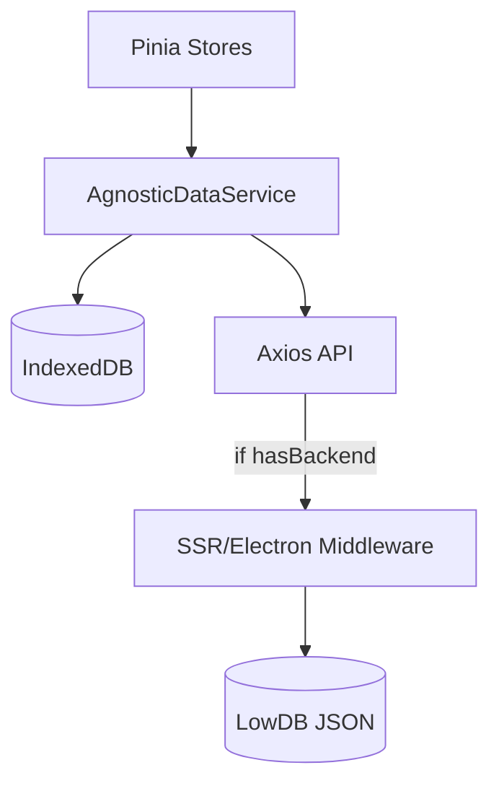

<!--
  Copyright (C) 2025-2026 Sam <websam101@gmail.com>

  This program is free software: you can redistribute it and/or modify
  it under the terms of the GNU General Public License as published by
  the Free Software Foundation, either version 3 of the License, or
  (at your option) any later version.

  This program is distributed in the hope that it will be useful,
  but WITHOUT ANY WARRANTY; without even the implied warranty of
  MERCHANTABILITY or FITNESS FOR A PARTICULAR PURPOSE.  See the
  GNU General Public License for more details.

  You should have received a copy of the GNU General Public License
  along with this program.  If not, see <https://www.gnu.org/licenses/>.
-->
# Services & Architecture

This directory contains the core logic for data management and OS-level interactions. The architecture is designed to be **platform-agnostic**, ensuring the application works seamlessly in Electron, SSR, and SPA modes.

## 🏗️ Agnostic Data Architecture

We use a "Local-First" approach where data is primarily stored in the browser's **IndexedDB** and optionally synchronized with a local **JSON backend**.

### Key Components:
1. **`AgnosticDataService.ts`**: The central orchestrator. It checks for backend availability and handles the logic of writing to local storage first, then syncing to the backend if possible.
2. **`StorageAdapter` (Interface)**: Defines the contract for database operations.
3. **`IndexedDbAdapter.ts`**: The default implementation for browser-based storage.

### 💾 Backup & Restore Logic
The `AgnosticDataService` provides methods for full application state management:
- **`exportAllData()`**: Aggregates all data from IndexedDB (Projects, Bookmarks, Collections, Settings) into a single, versioned JSON bundle.
- **`importAllData(json)`**: Validates and replaces the current local state with the provided backup, optionally pushing the new state to the backend if reachable.

## 🖥️ Server Services (Node.js Only)

These services are only executed in **Electron** or **SSR** environments via the middleware layer.

- **`SystemMonitor.ts`**: Tracks CPU, RAM, Disk, and Network usage using `systeminformation`.
- **`ProjectManager.ts`**: Handles recursive file scanning, Git status extraction (`simple-git`), and tech stack detection.
- **`ActionExecutor.ts`**: Executes OS commands like opening VS Code or a terminal.

## 📡 API Endpoints (SSR/Electron)

All backend interactions happen via the following endpoints:

| Endpoint | Method | Description |
| :--- | :--- | :--- |
| `/api/system/stats` | GET | Real-time system resource metrics. |
| `/api/utils/check-port` | POST | Check if a specific port is in use. |
| `/api/actions/open-task-manager` | POST | Open the system's native task manager. |
| `/api/projects/scan` | POST | Recursively scan a directory for projects. |
| `/api/projects/update` | POST | Sync a project's metadata to the JSON backend. |
| `/api/settings` | GET/POST | Pull or push application settings. |

---

_Refer to the [Store Guide](./stores.md) to see how components consume these services._
