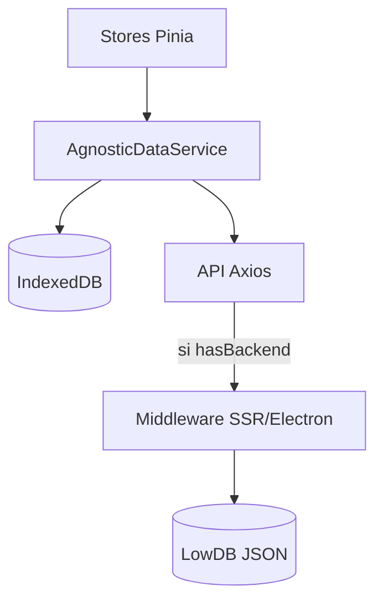

# Services & Architecture

Ce répertoire contient la logique métier pour la gestion des données et les interactions avec le système d'exploitation. L'architecture est conçue pour être **agnostique**, garantissant que l'application fonctionne parfaitement dans les modes Electron, SSR et SPA.

## 🏗️ Architecture des Données Agnostique

Nous utilisons une approche "Local-First" où les données sont principalement stockées dans l'**IndexedDB** du navigateur et synchronisées de manière optionnelle avec un **backend JSON** local.

### Composants Clés :
1. **`AgnosticDataService.ts`** : L'orchestrateur central. Il vérifie la disponibilité du backend et gère la logique d'écriture dans le stockage local en priorité, puis la synchronisation avec le backend si possible.
2. **`StorageAdapter` (Interface)** : Définit le contrat pour les opérations de base de données.
3. **`IndexedDbAdapter.ts`** : L'implémentation par défaut pour le stockage côté navigateur.

## 🖥️ Services Serveur (Node.js uniquement)

Ces services ne sont exécutés que dans les environnements **Electron** ou **SSR** via la couche middleware.

- **`SystemMonitor.ts`** : Suit l'utilisation du CPU, de la RAM, du disque et du réseau via `systeminformation`.
- **`ProjectManager.ts`** : Gère le scan récursif de fichiers, l'extraction de l'état Git (`simple-git`) et la détection des stacks techniques.
- **`ActionExecutor.ts`** : Exécute des commandes OS comme l'ouverture de VS Code ou d'un terminal.

## 📡 Points de terminaison API (SSR/Electron)

Toutes les interactions backend passent par les points de terminaison suivants :

| Point de terminaison | Méthode | Description |
| :--- | :--- | :--- |
| `/api/system/stats` | GET | Métriques des ressources système en temps réel. |
| `/api/utils/check-port` | POST | Vérifie si un port spécifique est utilisé. |
| `/api/actions/open-task-manager` | POST | Ouvre le gestionnaire de tâches natif du système. |
| `/api/projects/scan` | POST | Scanne récursivement un répertoire pour trouver des projets. |
| `/api/projects/update` | POST | Synchronise les métadonnées d'un projet vers le backend JSON. |
| `/api/settings` | GET/POST | Récupère ou pousse les paramètres de l'application. |

---

_Consultez le [Guide des Stores](./README.md) pour voir comment les composants consomment ces services._
