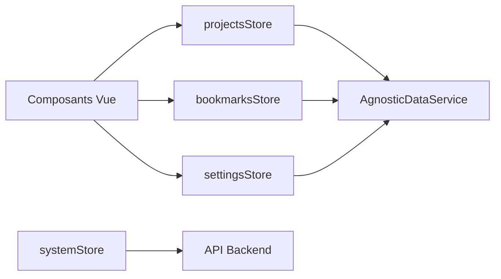

<!--
  Copyright (C) 2025-2026 Sam <websam101@gmail.com>

  This program is free software: you can redistribute it and/or modify
  it under the terms of the GNU General Public License as published by
  the Free Software Foundation, either version 3 of the License, or
  (at your option) any later version.

  This program is distributed in the hope that it will be useful,
  but WITHOUT ANY WARRANTY; without even the implied warranty of
  MERCHANTABILITY or FITNESS FOR A PARTICULAR PURPOSE.  See the
  GNU General Public License for more details.

  You should have received a copy of the GNU General Public License
  along with this program.  If not, see <https://www.gnu.org/licenses/>.
-->
# Gestion d'État (Pinia)

L'application utilise **Pinia** pour la gestion centralisée de l'état. Chaque store est responsable d'un domaine spécifique et interagit avec l'`AgnosticDataService` pour la persistance.

## 📦 Aperçu des Stores

### 1. `settingsStore`
Gère la configuration de l'application (Mode Sombre, Langue, visibilité des Stats Système).
- **Persistance :** Se synchronise automatiquement vers IndexedDB et le backend JSON lors d'un changement.
- **Action Clé :** `init()` - Charge les paramètres et applique le thème.

### 2. `projectsStore`
Gère la liste des projets locaux suivis.
- **Persistance :** Utilise `AgnosticDataService` pour sauvegarder les métadonnées des projets.
- **Intelligence :** Déclenche les actions de scan et de synchronisation Git via l'API backend.
- **Action Clé :** `addManualProject()` - Permet d'ajouter des projets sans accès au système de fichiers.

### 3. `bookmarksStore`
Gère la bibliothèque de ressources, incluant les collections et les liens favoris.
- **Structure :** `Collection` -> `Favori`.
- **Métadonnées :** Interagit avec le backend pour récupérer les titres et descriptions des URLs.

### 4. `systemStore`
Gère les données de performance système en temps réel.
- **Réactif :** Se met à jour toutes les 5 secondes lorsque le paramètre "Afficher les statistiques système" est activé.
- **Capacités :** Relaye les actions de niveau OS comme la vérification des ports et l'ouverture du Gestionnaire de tâches.

## 🔄 Interactions entre Stores

Les stores dépendent souvent les uns des autres ou de services partagés :

## 🧪 Tester les Stores
Chaque store possède un fichier `.spec.ts` correspondant. Nous utilisons `createTestingPinia` pour mocker les dépendances lors des tests unitaires.

---

_Consultez le [Guide Développeur](../dev/README.md) pour les commandes de build et de test._
