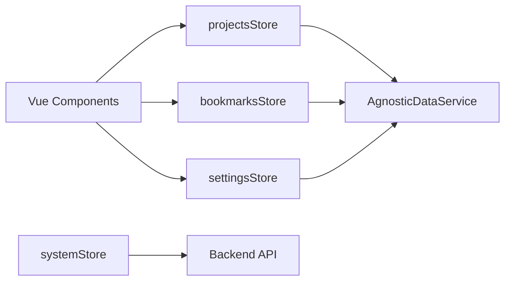

<!--
  Copyright (C) 2025-2026 Sam <websam101@gmail.com>

  This program is free software: you can redistribute it and/or modify
  it under the terms of the GNU General Public License as published by
  the Free Software Foundation, either version 3 of the License, or
  (at your option) any later version.

  This program is distributed in the hope that it will be useful,
  but WITHOUT ANY WARRANTY; without even the implied warranty of
  MERCHANTABILITY or FITNESS FOR A PARTICULAR PURPOSE.  See the
  GNU General Public License for more details.

  You should have received a copy of the GNU General Public License
  along with this program.  If not, see <https://www.gnu.org/licenses/>.
-->

# State Management (Pinia)

The application uses **Pinia** for centralized state management. Each store is responsible for a specific domain and interacts with the `AgnosticDataService` for persistence.

## 📦 Store Overview

### 1. `settingsStore`
Manages application configuration (Dark Mode, Locale, System Stats visibility).
- **Persistence:** Automatically syncs to IndexedDB and the JSON backend on change.
- **Key Action:** `init()` - Loads settings and applies the theme.

### 2. `projectsStore`
Manages the list of tracked local projects.
- **Persistence:** Uses `AgnosticDataService` to save project metadata.
- **Intelligence:** Triggers scanning and Git sync actions via the backend API.
- **Key Action:** `addManualProject()` - Allows adding projects without a filesystem.

### 3. `bookmarksStore`
Manages the resource library, including collections and favorite links.
- **Structure:** `Collection` -> `Bookmark`.
- **Metadata:** Interacts with the backend to fetch URL titles and descriptions.

### 4. `systemStore`
Handles real-time system performance data.
- **Reactive:** Updates every 5 seconds when the "Show System Statistics" setting is enabled.
- **Capabilities:** Proxies OS-level actions like checking ports and opening the Task Manager.

## 🔄 Store Interactions

Stores often depend on each other or shared services:

## 🧪 Testing Stores
Every store has a corresponding `.spec.ts` file. We use `createTestingPinia` to mock dependencies during unit tests.

---

_Refer to the [Developer Guide](../../docs/dev/README.md) for build and test commands._
